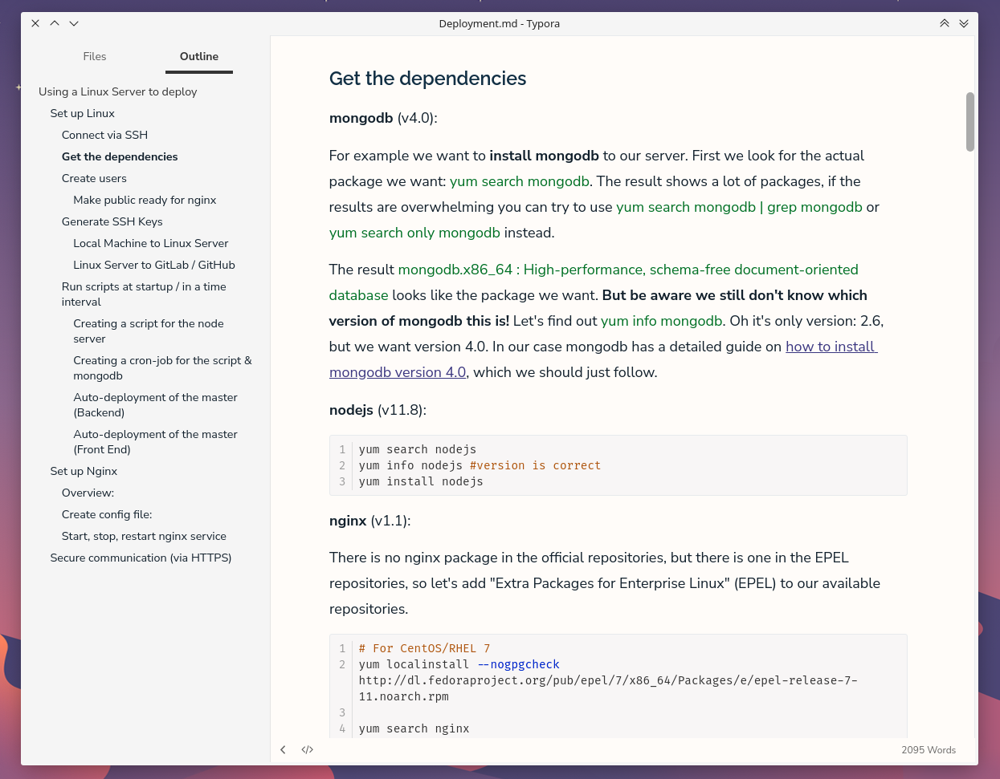

# Typora Theme: Rim

Light minimalist Typora Theme, which respects your eyes.

## Usage

If your running **Linux** or **Mac** you can use the `install.sh` script.

```bash
git clone https://github.com/Rimseg/typora-theme-rim
cd typora-theme-rim
sh install.sh
```

### Windows and unknown folder location

1. Download the .zip file
2. Look up where your [Typora theme folder](https://theme.typora.io/doc/Install-Theme/ ) is located.
3. Extract the .zip file there 

## Easy Customisation

Edit the file variables to get the style you prefer.

```css
:root {
	/* fonts */
	--font-heading: "Raleway";
	--font-text: "Nunito Sans";
	--font-code: "Fira Code";

	/* font-weight */
	--fw-heading-h1: bold;
	--fw-heading-h2: bold;
	--fw-heading: 600;
	--fw-text: normal;
	--fw-code: normal;
	
	/* line-height */
	--lh-s: 1.3;
	--lh-md: 1.4;
	--lh-l: 1.8;
	
	/* text color */
	--c-heading: #152E45;
	--c-text: #13202C;
	--c-code: #13202C;
	--c-link: #3E3282;

	/* color */
	--c-bg: #FFFCF9;
	--side-bar-bg-color: #F5F5F5;
	--c-bg-code: #F8F6F6;
	--c-primary: #4E3E8B;

	/* font-sizes */
	--fs-base: 18px;
	--fs-print: 13px;
	--fs-h1: 1.9rem;
	--fs-h2: 1.6rem;
	--fs-h3: 1.3rem;
	--fs-h4: 1.15rem;
	--fs-h5: 1rem;
	--fs-h6: 1rem;
	--fs-text: 1rem;
	--fs-code: .8rem;
	--fs-sidebar: .8rem;

	/* spacing */
	--w-writer-xl: 860px;
	--w-writer-l: 820px;
	--w-writer-md: 780px;
	--mt-h1: 1rem;
	--mt-h2: 2.2rem;
	--mt-h3: 2rem;
	--mt-h4: 1.8rem;
	--mt-h5: 1.6rem;
	--mt-h6: 1.6rem;
	--mt-hx-hx: 1rem;
	--mb-hx: 1rem;

	/* border */
	--border-ui: 1px solid #E7EAED;
	--border-table: 1px solid #ccc;
}
```

